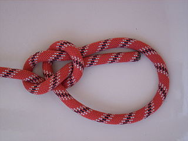
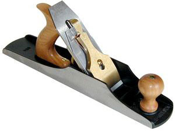

name: default
layout: true
class: middle

---
name: title
class: center

## Introduction to [Bowline](https://github.com/davenuman/bowline)

### Dockerizing Drupal Projects

### http://davenuman.github.io/



???
Me:
- Senior developer at CivicActions
- Live in Hamilton. wife and 2yo daughter
- Drupal 7+yrs, DevOps, woodworking, linux

Only 13 slides but i removed at least as many while preparing this so do interrupt if i'm skipping over assumptions. But please save longer questions for the end.

---
class: center
# Developer Experience
### UX for DevOps?

???
We talk a lot about UX in our field. I want to talk about Developer Experience.

Example: woodworking hobby.

---
class: center
"It's not about the tools"
 -- (often said in DevOps)

| Powerful | Elegant |
|:---------|:--------|
|  |   |

 ...but the tools are important.


???
The tools we use shape our developer experience.
When I use a hand plane, I love the experience.
It engages all my senses. keep developing a skill. Ready to use, no set up.
But not just tools, attitude - frame of mind, culture.

So, what might be involved in a positive DX?

---
# A Positive Developer Experience

 - Minimal Ramp up time
 - Context switching
 - Learnable patterns
 - Mastery

???
 - Bullets kill.

---
## Motivation

> We desire a consistent system that provides rapid sandbox set up,
> with flexibility for old and new Drupal projects
> and can contain project specific infrastructure.

> ...and also be used on ci server in the same way for testing.

---
class: center

| Vagrant | Docker |
|:--------|:-------|
| Virtual Machine | Virtual Environment  |

???

Lots of options available. We chose docker.

---
class: center
#Introducing Bowline


Bowline is a set of (hopefully) simple tools focussed on easing docker set up and collating project things.

???
Mostly bash

- Bowline objectives:
 - minimize requirements (just needs docker 1.3+)
 - containerize as much as possible
 - hackability

---
`. bin/activate`

```bash
[ "$(alias | grep deactivate)" ] && deactivate  # In case already activated.
GIT_ROOT=$(git rev-parse --show-toplevel)
alias deactivate="export PATH=$PATH; export PS1=\"$PS1\"; unset BOWLINE"
export PATH=$GIT_ROOT/bin:$PATH
export BOWLINE=${GIT_ROOT##*/}

if [ "$SHELL_TYPE" = "bash" ];then
  export PS1="${PS1}\[\033[01;31m\](${BOWLINE})\[\033[00m\] \$ "
else
  export PS1="${PS1} (${BOWLINE}) \$ "
fi
```

???
This is really important... when activated, new commands are available in your current shell environment. Some of those override commands you may already have such as drush, composer

---
## Bowline activated

```bash
Available commands:
activate  bowline  composer  fix-perms  invoke_proxy  settings_init
backup    build    drush     import     run

Containers:
db   ~  172.17.0.61
web  ~  172.17.0.62  http://172.17.0.62/
Proxy:
	http://bowline.localtest.me/
```

---
class: center

# Demo

---

class: center


???
Yes, it works with D8.

---
## Hoist

```bash
~/workspace/bowline (bowline) » hoist
Usage: hoist [rigging]
Available riggings:
behat  drupal-core-dev
```

---

## bin/run (Simplified)

```bash
#!/usr/bin/env bash

source $(dirname $0)/../lib/bowline/bowline
enter_container

# Check Drush.
cd docroot
../vendor/bin/drush st
cd ..

# Behat tests
./vendor/bin/behat -c tests/behat/local.yml
```

---
## bin/run (Simplified) with migration

```bash
#!/usr/bin/env bash

source $(dirname $0)/../lib/bowline/bowline
enter_container

# Behat tests
./vendor/bin/behat -c tests/behat/local.yml

# Run Migration
cd docroot
../vendor/bin/drush migrate-deregister --orphans
../vendor/bin/drush migrate-register
../vendor/bin/drush migrate-import --group=globalnet --limit=$LIMIT --force
../vendor/bin/drush migrate-status
```

---
## General Issues to solve

- Performance in boot2docker
- Incomplete set of tools

[https://github.com/davenuman/bowline/issues](https://github.com/davenuman/bowline/issues)

---
class: inverse
# Questions?
.footnote[Slideshow created using [remark](http://github.com/gnab/remark).]

